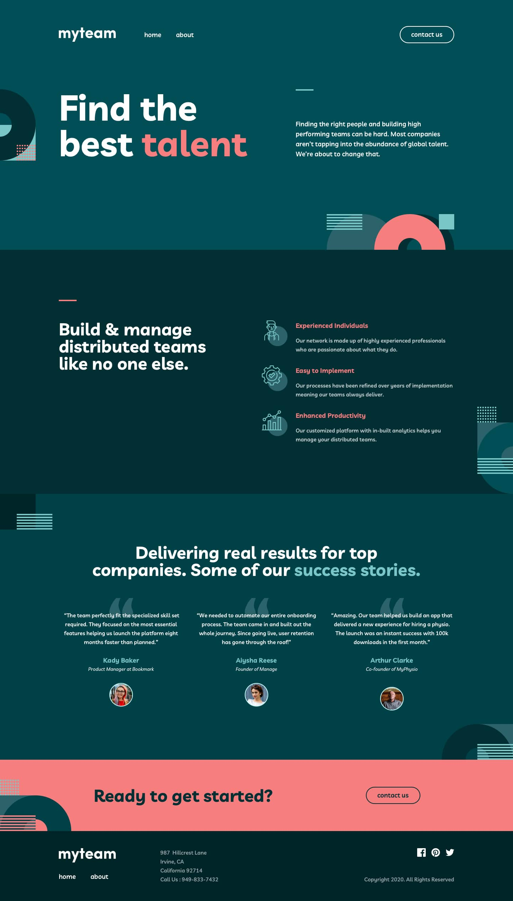

<h1 align="center">Frontend Mentor Challenge | myteam multi-page website</h1>

<strong>SASS / Vanilla JavaScript</strong>

Your challenge is to build out this multi-page website and get it looking as close to the design as possible. The download includes mobile, tablet & desktop designs for a Homepage, About page and a Contact page. A design system is also included to provide colors, fonts, etc.

You can use any tools you like to help you complete the challenge. So if you've got something you'd like to practice, feel free to give it a go.

Your users should be able to:

View the optimal layout for each page depending on their device's screen size 
See hover states for all interactive elements throughout the site 
See the correct content for each team member on the About page when the + icon is clicked 
Receive an error message when the contact form is submitted if: 
The Name, Email Address or Message fields are empty should show "This field is required" 
The Email Address is not formatted correctly should show "Please use a valid email address" 

[Frontend Mentor Challenge](https://www.frontendmentor.io/challenges) coded by [Elie Bissor](https://www.eliewd.com)
